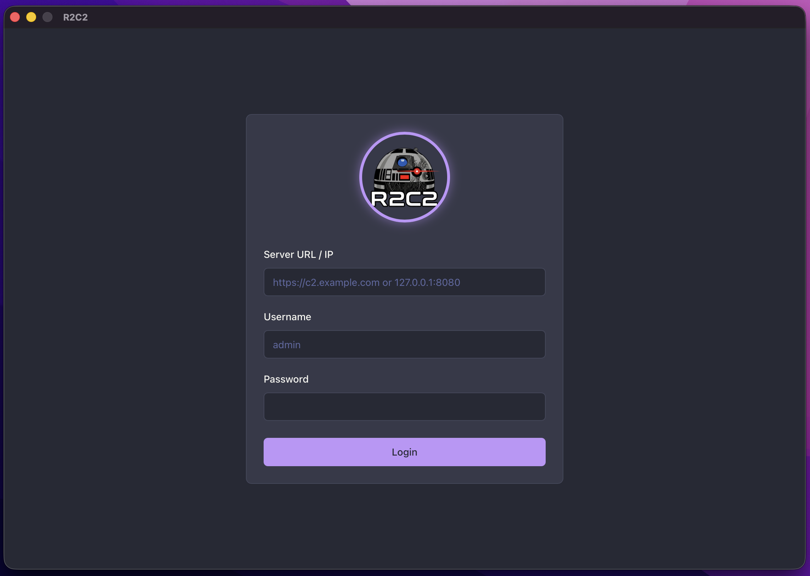

# Login

To access the R2C2 Client dashboard, you must authenticate against a running Teamserver instance.

 

## 🔐 Authentication Steps

1.  **Launch the Client**: Open the R2C2 application on your desktop.
2.  **Server URL**: Enter the full URL of your Teamserver API.
    *   Example (Local): `http://localhost:8080`
    *   Example (Remote): `https://c2.example.com`
3.  **Enter Credentials**: Input the username and password corresponding to an operator account.

## ⚙️ Configuration

Operator credentials are managed directly on the Teamserver. You can find or modify them in the `config.yaml` file located in the server's root or configuration volume.

```yaml
operators:
    - username: anakin
      password: admin123  <-- Change this!
```

> **⚠️ Security Warning**: The default credentials (`anakin` / `admin123`) should be changed immediately before deploying the Teamserver in any shared or production environment.